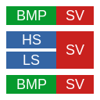

<!--
    Copyright 2023 William Swartzendruber

    To the extent possible under law, the person who associated CC0 with this file has waived
    all copyright and related or neighboring rights to this file.

    You should have received a copy of the CC0 legalcode along with this work. If not, see
    <http://creativecommons.org/publicdomain/zero/1.0/>.

    SPDX-License-Identifier: CC0-1.0
-->

# Introduction

This project aims to provide implementors of custom character encodings a much easier method of
doing so, so long as the custom encoding works with Unicode scalar values.

[See the main project's ReadMe for more information.](RuneEncoding/ReadMe.md)

# Licensing

Different portions of this project are placed under different licenses:

| Component     | License       | SPDX ID                           |
|---------------|---------------|-----------------------------------|
| Library       | Public Domain | [`CC0-1.0`](LICENSES/CC0-1.0.txt) |
| Documentation | Public Domain | [`CC0-1.0`](LICENSES/CC0-1.0.txt) |
| Images        | Public Domain | [`CC0-1.0`](LICENSES/CC0-1.0.txt) |
| Examples      | Public Domain | [`CC0-1.0`](LICENSES/CC0-1.0.txt) |
| Build scripts | Public Domain | [`CC0-1.0`](LICENSES/CC0-1.0.txt) |
| Unit tests    | Public Domain | [`CC0-1.0`](LICENSES/CC0-1.0.txt) |
